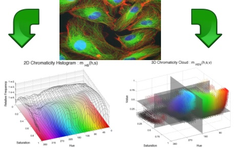

# caiman

<h1 style="text-align: center;"><i><i> CAIMAN: </i></i>CAncer IMage
ANalysis </h1>

The need for image analysis is ever
growing in many fields and cancer is not an exception. With the advent
of new imaging techniques such as intravital, confocal and multiphoton
microscopy, just to mention a few, researchers can visualise
physiological and pharmacological processes together with the
traditional anatomical images that have been improving resolution. Yet,
once the imaging of subjects has been achieved, sometimes there is a
lack of resources to properly analyse and process the data and the
wealth of the information contained in images and videos remains to be
extracted in the near future. The development of
methods of analysis that extract meaningful and quantitative
information from these images is an important part in the search of
understanding biological processes

 
CAIMAN originated as an Image Analysis internet-based project that combined the strength
of open-source web-based scripting languages, the powerful
high-level technical computing language MATLAB,
and the vast literature on image analysis and computer vision to
provide a user-friendly web-page where any person can upload
cancer-related images and execute analysis algorithms and obtain
quantitative measurements related to their images.

With time, it become evident that it was better to disseminate the algorithms as Matlab Scripts to be run locally instead of cloud-based. The algorithms available at CAIMAN can now be accessed in GitHub: 

* <b>shading correction </b>based on a signal envelope estimation retrospective algorithm, 
https://github.com/reyesaldasoro/shading-correction

</td>

* <b>measuring cellular migration</b> for scratch wound assays
https://github.com/reyesaldasoro/Cell-Migration

 

* <b>Microvessel Segmentation</b> from tissue stained with immunohistochemistry (CD-31, blue-brown)
https://github.com/reyesaldasoro/Microvessel-Segmentation

</td>

* <b>Tracing of vessels</b> for in-vivo intravital microscopy
https://github.com/reyesaldasoro/Scale-Space-Vessel-Tracing

* <b>Chromatic Analysis</b> originally for immunohistochemistry and intravital microscopy, but can be used for anything
https://github.com/reyesaldasoro/Chromatic-Analysis

</td>

